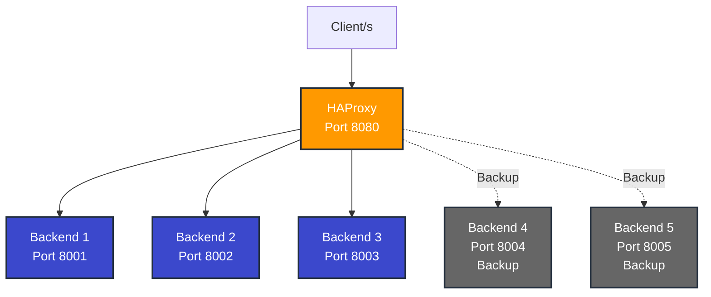

# HAProxy Load Balancing Demo


## Overview

This hands-on lab demonstrates multiple load balancing algorithms using HAProxy on AWS EC2. Students will configure and test different balancing strategies, understand health checks, and observe failover behavior.

## Learning Objectives

- Configure HAProxy as a load balancer
- Understand and compare different load balancing algorithms
- Implement health checks and failover mechanisms
- Monitor load balancer performance and statistics
- Test session persistence and content-based routing

## Algorithms Covered

| Algorithm | Use Case | Behavior |
|-----------|----------|----------|
| **Round Robin** | Equal capacity servers | Sequential distribution |
| **Least Connections** | Variable workloads | Prefers servers with fewer connections |
| **Random** | Simple uniform distribution | Random distribution |
| **Weighted Round Robin** | Different server capacities | Distribution based on weights |
| **Source IP Hash** | Session persistence | Same client → same server |
| **URI Hash** | Content-based routing | Same URL → same server |

## Prerequisites

- AWS EC2 instance (Amazon Linux 2023 recommended)
- Open ports: 22 (SSH), 8080 (HAProxy), 8001-8005 (Backends), 8404 (Stats)
- Basic Linux command line knowledge
- SSH access to EC2 instance

## Lab Structure

```
HAProxy Load Balancing Demo/
├── README.md                    # This file
├── setup.sh                     # Initial setup script
├── configs/                     # HAProxy configurations
│   ├── 01-roundrobin.cfg
│   ├── 02-leastconn.cfg
│   ├── 03-random.cfg
│   ├── 04-weighted.cfg
│   ├── 05-source-hash.cfg
│   ├── 06-uri-hash.cfg
│   └── 07-failover.cfg
├── scripts/                     # Test scripts
│   ├── test-roundrobin.sh
│   ├── test-leastconn.sh
│   ├── test-weighted.sh
│   ├── test-source-hash.sh
│   ├── test-uri-hash.sh
│   ├── test-failover.sh
│   └── load-test.sh
└── cleanup.sh                   # Cleanup script
```

## Quick Start

### 1. Clone the Repository

```bash
git clone https://github.com/gamaware/system-design-course.git
cd system-design-course/HAProxy\ Load\ Balancing\ Demo
```

### 2. Run Setup

```bash
chmod +x setup.sh
./setup.sh
```

This will:
- Install HAProxy and Python
- Create 5 backend servers on ports 8001-8005
- Start all backend services
- Configure initial HAProxy setup

### 3. Run Tests

Each algorithm has its own test script:

```bash
# Test Round Robin
./scripts/test-roundrobin.sh

# Test Least Connections
./scripts/test-leastconn.sh

# Test Weighted Round Robin
./scripts/test-weighted.sh

# Test Source IP Hash
./scripts/test-source-hash.sh

# Test URI Hash
./scripts/test-uri-hash.sh

# Test Failover
./scripts/test-failover.sh
```

### 4. Monitor Statistics

Access HAProxy statistics dashboard:
```
http://<your-ec2-public-ip>:8404/stats
```

### 5. Load Testing

Run load test to observe behavior under stress:
```bash
./scripts/load-test.sh
```

## Detailed Lab Instructions

### Scenario 1: Round Robin

**Objective**: Understand sequential distribution of requests.

```bash
./scripts/test-roundrobin.sh
```

**Expected Result**: Requests distributed evenly across all backends in sequence (1→2→3→1→2→3...).

### Scenario 2: Least Connections

**Objective**: See how HAProxy prefers servers with fewer active connections.

```bash
./scripts/test-leastconn.sh
```

**Expected Result**: When one server is busy, new requests go to less loaded servers.

### Scenario 3: Weighted Round Robin

**Objective**: Distribute traffic based on server capacity.

```bash
./scripts/test-weighted.sh
```

**Expected Result**: 
- Backend 1: ~50% of traffic (weight 50)
- Backend 2: ~30% of traffic (weight 30)
- Backend 3: ~20% of traffic (weight 20)

### Scenario 4: Source IP Hash

**Objective**: Maintain session persistence based on client IP.

```bash
./scripts/test-source-hash.sh
```

**Expected Result**: All requests from the same IP go to the same backend server.

### Scenario 5: URI Hash

**Objective**: Route requests based on URL path for caching optimization.

```bash
./scripts/test-uri-hash.sh
```

**Expected Result**: Same URI always routes to the same backend server.

### Scenario 6: Failover and Health Checks

**Objective**: Observe automatic failover when a backend fails.

```bash
./scripts/test-failover.sh
```

**Expected Result**: 
1. Traffic distributed across primary servers
2. When a server fails, traffic automatically redirects
3. Backup servers activate only when all primary servers are down
4. Failed server automatically rejoins when recovered

## Architecture Diagram



## Key Concepts

### Health Checks

HAProxy continuously monitors backend health:
- `inter 2s` - Check every 2 seconds
- `rise 2` - 2 successful checks to mark as UP
- `fall 3` - 3 failed checks to mark as DOWN

### Backup Servers

Servers marked as `backup` only receive traffic when all primary servers are down.

### Session Persistence

- **Source IP Hash**: Based on client IP address
- **URI Hash**: Based on request URL path
- **Cookie-based**: Using application cookies (not covered in this lab)

## Troubleshooting

### HAProxy won't start

```bash
# Check configuration syntax
sudo haproxy -f /etc/haproxy/haproxy.cfg -c

# Check logs
sudo journalctl -u haproxy -n 50
```

### Backend servers not responding

```bash
# Check if backends are running
ps aux | grep "python3 -m http.server"

# Test backend directly
curl http://localhost:8001
```

### Port already in use

```bash
# Find process using port
sudo lsof -i :8080

# Kill process if needed
sudo kill -9 <PID>
```

## Cleanup

Remove all lab resources:

```bash
./cleanup.sh
```

This will:
- Stop all backend servers
- Stop HAProxy service
- Remove temporary files and logs

## Additional Resources

- [HAProxy Documentation](https://docs.haproxy.org/)
- [HAProxy Configuration Manual](https://www.haproxy.com/documentation/haproxy-configuration-manual/latest/)
- [AWS EC2 Documentation](https://docs.aws.amazon.com/ec2/)

## Author

Created by [Alex Garcia](https://github.com/gamaware)

- [LinkedIn Profile](https://www.linkedin.com/in/gamaware/)
- [Personal Website](https://alexgarcia.info/)

## License

This project is licensed under the MIT License - see the [LICENSE](LICENSE) file for details.
